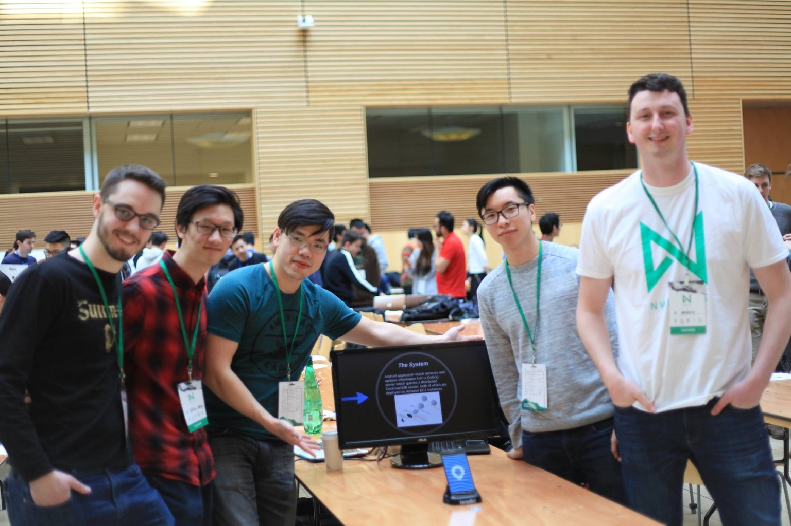
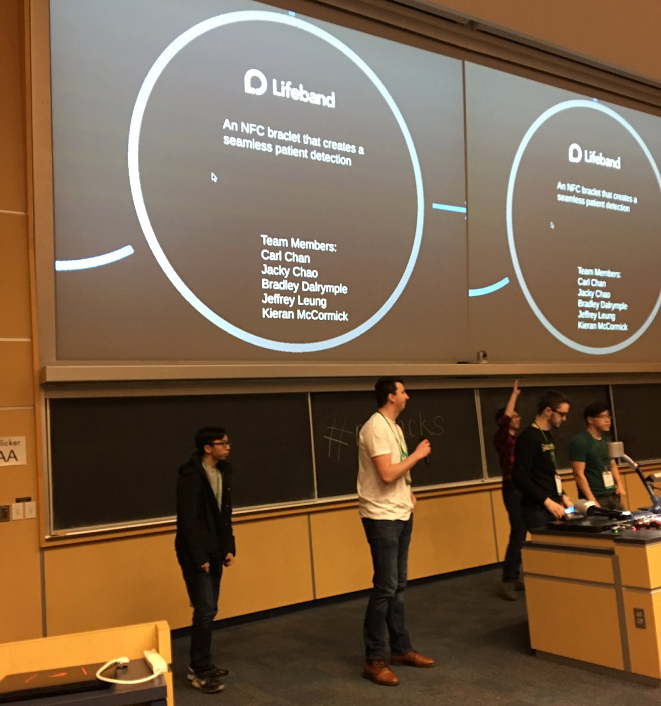
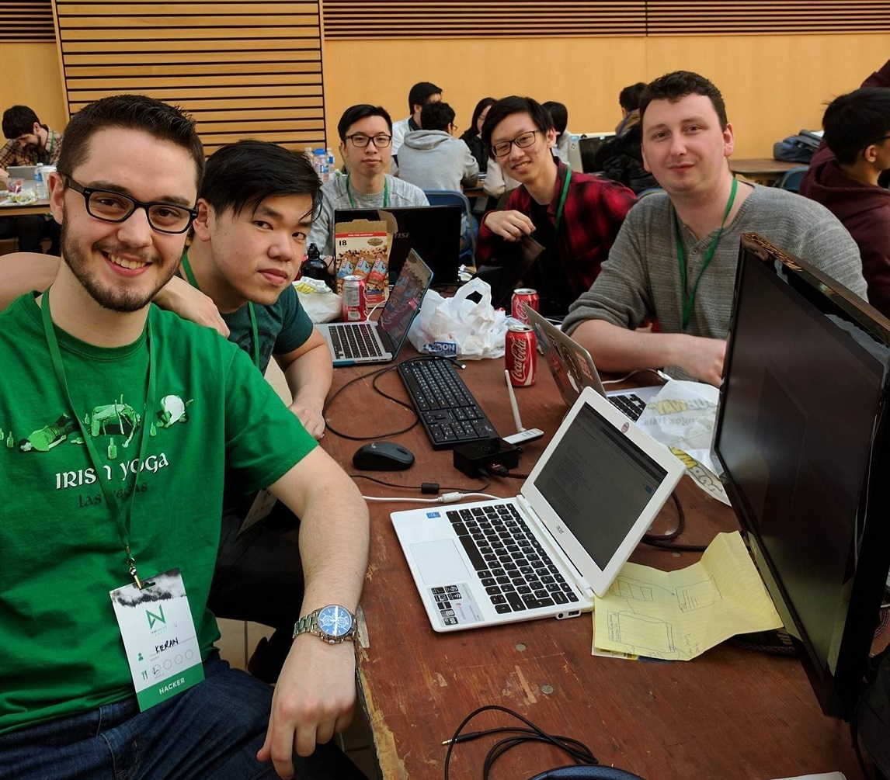

#  LifeBand (nwHacks 2017)

**LifeBand** is a wristband system designed to alleviate patient misidentification in hospitals and senior centers by managing patient medical record access. The project was created during March 18-19, 2017 for [nwHacks](https://www.nwhacks.io/), an annual hackathon hosted by StartupStorm from the University of British Columbia.

	

_We placed among the **top 5 projects.**_

## Inspiration and Problem

According to a study by the esteemed Johns Hopkins University, the third leading cause of death in the US is [patient misidentification](https://www.washingtonpost.com/news/to-your-health/wp/2016/05/03/researchers-medical-errors-now-third-leading-cause-of-death-in-united-states/). Over a quarter of a million people die annually due to preventable medical errors - that's 700 deaths a day, or 1 death every two minutes. We set out to envision a technological solution for this problem by better tying patients to their medical records.

## Solution

Our solution was to create an inexpensive solution which could be scaled to the needs of an entire country's medical records and would allow for maximum availability even when under immense usage. The software system would also allow for complex data analytics to be performed, resulting in a significant increase in medical statistics.

### The System and Technologies

Inexpensive and small identification tags which emit [NFC](http://electronics.howstuffworks.com/nfc-tag.htm) are attached to hospital beds, or placed on wristbands and given to residents of senior centers. These are registered with the records of the person they are given to.

Users interact with the tags by opening an Android application and scanning the tag with their NFC-enabled device. The application will contact a [Golang](https://golang.org/) server which will query a [CockroachDB](https://github.com/cockroachdb/cockroach) relational database, both of which are hosted on [Amazon Web Services](https://aws.amazon.com/). The patient data returned will be displayed on the device.

## Results

We placed among the top 5 projects in the hackathon and were invited to present in front of all participants as well as the final judges. The judges consisted of:

* [UBC President **Santa Ono**](https://en.wikipedia.org/wiki/Santa_J._Ono),
* Previous CEO of [Pathful](https://pathful.aerobaticapp.com/) and current CEO of [Proxxi](https://www.proxxi.co/) (acquired by Mobify) **Campbell Macdonald**,
* Co-founder of [Optigo Networks](https://www.optigo.net/) and board member of [Coast Mental Health](https://www.coastmentalhealth.com/) **Byron Thom**, and
* Product Lead of [1QBit](https://1qbit.com/) **David Byrd**.

## Lightning Talk Presentation

## About

The creators of this project are [Kieran McCormick](https://github.com/KieranMcCormick), [Jacky Chao](https://github.com/eul721), [Carlson Chan](https://github.com/carlsonchan), [Jeffrey Leung](https://github.com/jleung51), and [Bradley Dalrymple](https://github.com/Brad1321).

_Disclaimer: This page was created after the hackathon's completion._